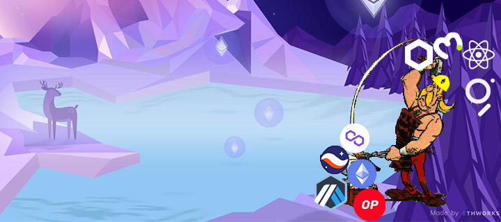

<h1 align="center">Hi 👋, I'm Joe Stakey</h1>
<h3 align="center">Web3 developer, building in the Ethereum ecosystem. Currently focusing on ZK</h3>
<h3 align="center">
 </h3>

 I'm a web developper 

- 🌱 I’m currently learning **Cairo**, to build Dapps in **StarkNet**
- 🔭 I have worked and deployed smart contracts on **Ethereum** and **Polygon**.

<h3 align="left">Contact me:</h3>

<h3 align="left">Languages</h3>

       

<h3 align="left">Tools:</h3>

         

